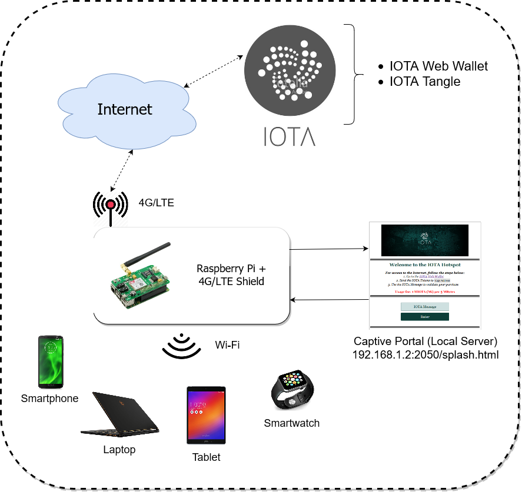

# IOTA-Hotspot

The Internet has become a fundamental part of our lives. For people that enjoy traveling around the world, apps such as Google Maps and Airbnb are essential to organize and carry out a holiday in another country or even continent. But what happens when you go to a foreign country where your smartphone does not provide roaming services? How do you find your way? Well, there are several options, but none of them address this issue properly. You might want to pay a monthly international mobile roaming service, but is it essential to pay an expensive service for more days than you need? Probably not, since the majority travel relying on the free Wi-Fi areas that they can find from local businesses. But can you always rely on such a method? Imagine you travel to a place on the other side of the world without knowledge of the local language, and let's say the locals do not speak English. Would you still comfortable traveling without a backup plan to get Internet?

  

For such scenarios, I purpose the IOTA Wi-Fi Hotspot for Urban Spaces. How is this outdoor Wi-Fi Hotspot different from others, you might ask? Well, with the IOTA Hotspot, you only pay what you need instead of some monthly service that may charge more than you require. But what is IOTA? IOTA is the digital money for the Internet of Things. As opposed to Bitcoin, IOTA is a non-blockchain based technology which means that transactions with IOTA are entirely fee-free. So, in fact, YOU ONLY PAY WANT YOU NEED!

For a full tutorial of how to implement this project, go to https://www.hackster.io/rodruizronald/iota-wi-fi-hotspot-for-urban-space-5330f1

## Software

* Raspbian Stretch.
* Nodogsplash.
* Pyota.

## Hardware

* Raspberry Pi 3B.
* 4G/LTE HAT.

## License

This project is licensed under the MIT License - see the [LICENSE.md](LICENSE.md) file for details.
